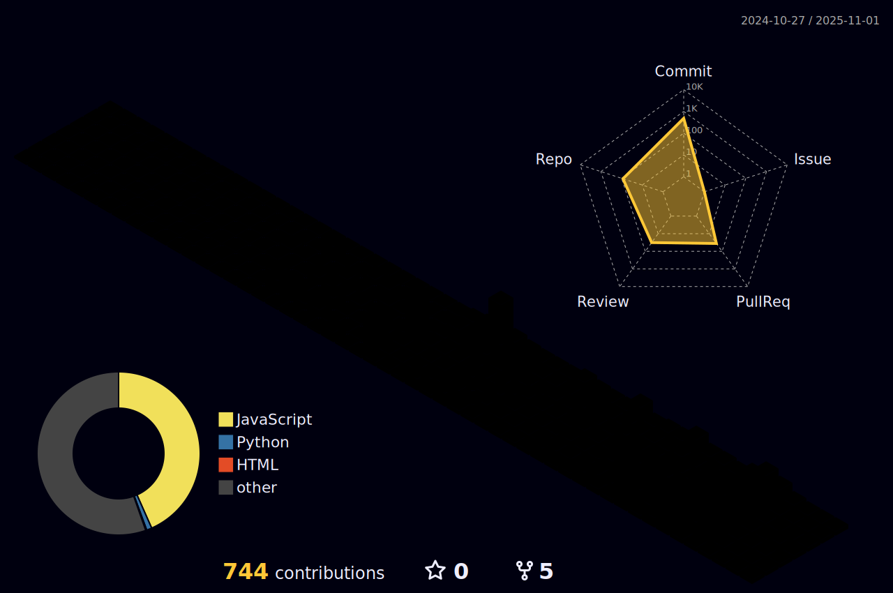

<h1 align="center">Ike Mwithiga</h1>

Architect | Creative Technologist | Built Environment Systems Designer

---

## About

I am a graduate architect and creative technologist working at the intersection of physical space and digital infrastructure. My work explores how thoughtful design and software systems can improve how people experience, manage, and interact with the built environment.

My architectural background focuses on residential and commercial design, sustainability strategies, luxury detailing, and digitally precise workflows. Alongside architectural practice, I design and develop web and mobile applications that support collaboration, property operations, and spatially informed digital tools.

I approach both architecture and software through systems thinking, human-centered design, and long-term maintainability. I am particularly interested in how technology can support housing, community infrastructure, and collaborative design workflows.

---

## What I Am Building

### Zurihaus

Zurihaus is a property and community operating system designed to connect tenants, landlords, property managers, caretakers, and security teams through a shared digital infrastructure.

The platform focuses on improving communication, maintenance workflows, incident tracking, and operational transparency across residential and mixed-use developments. It is designed as a modular PropTech ecosystem where independent services such as security, billing, and community engagement can function both together and as standalone SaaS modules.

Core exploration areas include:

- Property operations and maintenance workflows  
- Real-time stakeholder communication systems  
- Predictive analytics for rent, maintenance, and facility management  
- Scalable architecture for multi-property and multi-service platforms  

---

### Synchaus

Synchaus is an architectural and design client collaboration portal developed to support architecture firms in managing projects, client communication, documentation, and workflow transparency.

The platform is designed as a digital extension of the design studio, allowing firms to provide clients with structured access to drawings, updates, feedback cycles, and project milestones.

The system focuses on:

- Structured client communication environments  
- Centralized drawing and document management  
- Design iteration tracking and approval workflows  
- Integration into firm websites as a leased or white-label service  

---

### Personal Architecture Research and Design

I am actively exploring residential architecture concepts that prioritize environmental performance, social cohesion, and spatial clarity. Current design explorations include atrium-centered family housing, sustainable site planning strategies, and contextual material expression.

---

## Design Philosophy

My work is driven by the belief that software and architecture are both forms of spatial design.

I treat interfaces as environments, user flows as circulation paths, and system architecture as infrastructure design. My approach emphasizes clarity, intentionality, and emotional resonance, informed by environmental psychology and human behavior within spaces.

Across both physical and digital design, I prioritize systems that are adaptable, maintainable, and grounded in real human needs.

---

## Technical Work

### Frontend Development

I build responsive and interactive user interfaces with a strong focus on usability, performance, and visual clarity. My frontend work emphasizes component modularity, clean state management, and design consistency.

Primary focus areas include:

- React ecosystem development  
- TypeScript-driven scalable interface design  
- Advanced CSS animation and interaction systems  
- API-driven dashboards and data visualization  

---

### Backend and Systems Development

I build backend logic and database architectures that support scalable SaaS platforms, collaborative workflows, and real-time data interaction.

Areas of focus include:

- Python for backend services, automation, and workflow scripting  
- Supabase for database architecture, authentication, and real-time infrastructure  
- REST and RPC based service design  
- Data-driven application logic and system integration  

---

### Database and Infrastructure

I design relational database structures and system workflows that prioritize reliability, clarity, and long-term scalability. My work often focuses on modeling real-world operational relationships such as tenant, landlord, service provider, and administrative workflows.

---

## Tools and Software

<table>
<tr>
<td width="50%" valign="top">

### Architecture and Design

</td>

<td width="50%" valign="top">

### Technology and Development

</td>
</tr>
</table>

---

## Current Learning and Exploration

- Predictive analytics and data modeling for built environment platforms  
- Generative and parametric design integration with software workflows  
- Immersive and spatial web technologies  
- Advanced database optimization and scalable SaaS architecture  

---

## Listening While Building

Music plays an important role in my design and development process. I treat sound as part of my creative environment, often using it to shape focus, pacing, and creative rhythm while working.

  

---

## Impact and Direction

My long-term work focuses on building digital systems that support the housing and property ecosystem. I am particularly interested in how technology can improve transparency, collaboration, and operational efficiency across residential communities and design practices.

I am committed to developing tools that merge spatial thinking, software engineering, and human-centered design into cohesive and meaningful platforms.

---

## Selected Interests

PropTech  
Built Environment Technology  
Design Systems  
Spatial UX  
Collaborative Design Platforms  
Community Infrastructure Technology  
Human-Centered SaaS Design  

---

## Collaboration

I am open to collaborating on projects involving:

- PropTech and housing technology platforms  
- Architecture workflow digitization tools  
- Built environment data systems  
- Design-technology crossover products  
- Spatial computing and immersive web projects  

---

## GitHub Activity

  
  

  

---

## Writing and Thought Work

I write about architecture, software development, and the relationship between spatial design and digital systems.

https://ithoughtialready.hashnode.dev

---

## Contact and Professional Presence

LinkedIn: https://linkedin.com  
Portfolio: (Add portfolio link)  
Email: (Add preferred contact email)

---

## Closing

I view design as the shaping of experience across mediums. Whether through architecture or software, my goal is to create systems that are intentional, clear, and meaningful to the people who use them.
